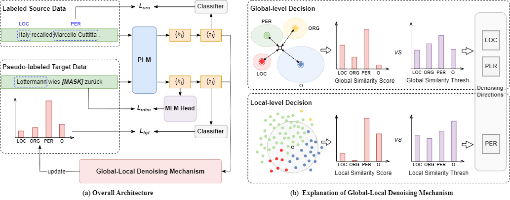

# GLoDe
Code for IJCAI 2024 paper "[Improving Pseudo Labels with Global-Local Denoising Framework for Cross-lingual Named Entity Recognition](https://arxiv.org/pdf/2406.01213)"
# Model architecture

# Requirements
To install requirements:
```python
pip install requirements.txt
```
# Data preparation
* For convenience, it is recommended to use the example we gave to arrange the file directory
  > data/
  >
  > ├── datasetName_languageName/
  > 
  > │   ├── spanner.train
  >
  > │   ├── spanner.dev
  >
  > │   ├── spanner.unlabel
  >
  > │   └── spanner.test
* The data needs to follow the json format given in the file. Conll2003 data formats (as shown in the text file) can be processed using the bio2spannerformat.py
*  spanner.train and spanner.dev are dataset from the source language, and spanner.unlabel and spanner.test are from the target language.
# Run
> For more details, see the files.
> 
> We load the pre-trained model from a local file and have the PRETRAINED variable defined in the script file. Please handle it according to your own situation
## Generate pseudo labels for target language
```bash
# target_language_name; dataset_name; epochs
bash generate_pseudo_labels.sh demoLang conll03 8
```
## Train the target model
```bash
# target_language_name; dataset_name; epochs; pseudo_labels_id(based on the epoch of generate_pseudo_labels.py)
bash train_tgt_model.sh demoLang conll03 5 7
```
# Acknowledgements
Our code framework refers to [ContProto](https://github.com/DAMO-NLP-SG/ContProto), many thaks.
# Citation
If you find this repository useful, please cite our paper. Thanks for your support.